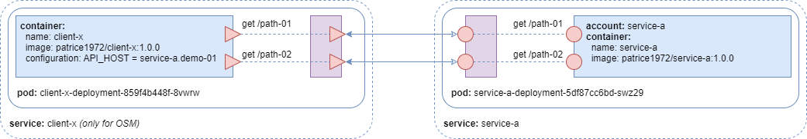
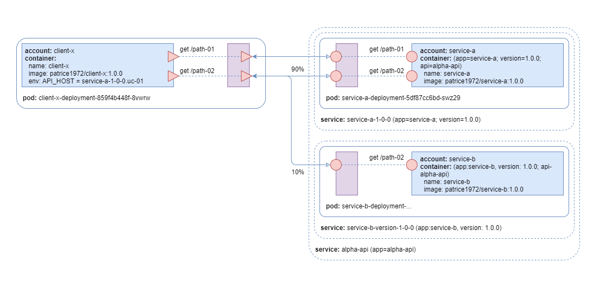

# Use Cases for Service Mesh

The goal of these use cases is to **test** and **compare** different service mesh implementations.

## Prerequisites

To run the different demos, you need to have a running Kubernetes cluster with an access to it via the `kubectl` CLI, as well as Open Service Mesh running (OSM) on top of it. You can follow these two documents to get a proper environment:

* [Playing with Azure Kubernetes Service (AKS)](https://github.com/patricekrakow/learning-stuff/blob/master/playing-with-AKS.md)
* [Playing with OSM](https://github.com/patricekrakow/learning-stuff/blob/master/playing-with-OSM/playing-with-OSM.md)

## UC-01 | Routing of an _API endpoint_ request to the right _service_

### UC-01.01 | Initial situation

Let's have `Alpha API` an _API_ with **two** _API endpoints_:

* `get /path-01`
* `get /path-02`

Let's have `client-x` a _service_ calling these two _API endpoints_.

Let's have `service-a` a _service_ implementing the **two** _API endpoints_ of `Alpha API`. More precisely, let's have the _version_ `1.0.0` of `service-a` implementing these **two** _API endpoints_.



__*WARNING.*__ The `client-x` MUST NOT know the implementation details of the `Alhpa API`, and that includes the _service_ which implements it. So, we could add an additional _network name_ like `aplha-api` that would represent the _API_. However, as the _API endpoints_ such as `get /path-01` and `get /path-02` are distinct, we can have only one unique network name such as `acme-api`. If, and only if, we would have a collision about two or more different _API endpoints_ having the same name, then, and only then, we can still use a different network name such as `<differentiator>.acme-api`.


#### Demo Configuration

The Kubernetes manifests of the above situation can be written as follow:

```yaml
# uc-01.01.yaml
---
# Deploy 'uc-01' Namespace
apiVersion: v1
kind: Namespace
metadata:
  name: uc-01
---
# Deploy 'service-a' Service Account
apiVersion: v1
kind: ServiceAccount
metadata:
  name: service-a
  namespace: uc-01
---
# Deploy 'service-a-version-1-0-0-deployment' Deployment
apiVersion: apps/v1
kind: Deployment
metadata:
  name: service-a-version-1-0-0-deployment
  namespace: uc-01
spec:
  replicas: 1
  selector:
    matchLabels:
      app: service-a
      version: 1.0.0
  template:
    metadata:
      labels:
        app: service-a
        version: 1.0.0
        api: acme-api
    spec:
      serviceAccountName: service-a
      containers:
      - name: service-a
        image: patrice1972/service-a:1.0.0
        ports:
        - name: service-a-port
          protocol: TCP
          containerPort: 3000
---
# Deploy 'service-a-version-1-0-0' Service
apiVersion: v1
kind: Service
metadata:
  name: service-a-version-1-0-0
  namespace: uc-01
spec:
  selector:
    app: service-a
    version: 1.0.0
  ports:
  - protocol: TCP
    port: 3000
    targetPort: 3000
---
# Deploy 'acme-api' Service
apiVersion: v1
kind: Service
metadata:
  name: acme-api
  namespace: uc-01
spec:
  selector:
    api: acme-api
  ports:
  - protocol: TCP
    port: 3000
    targetPort: 3000
---
# Deploy 'client-x' Service Account
apiVersion: v1
kind: ServiceAccount
metadata:
  name: client-x
  namespace: uc-01
---
# Deploy 'client-x-version-1-0-1-deployment' Deployment
apiVersion: apps/v1
kind: Deployment
metadata:
  name: client-x-version-1-0-1-deployment
  namespace: uc-01
spec:
  replicas: 1
  selector:
    matchLabels:
      app: client-x
      version: 1.0.1
  template:
    metadata:
      labels:
        app: client-x
        version: 1.0.1
    spec:
      serviceAccountName: client-x
      containers:
      - name: client-x
        image: patrice1972/client-x:1.0.1
        env:
        - name: API_HOST
          value: "acme-api.uc-01"

```

You can deploy them using the following command:

```text
$ kubectl apply -f https://raw.githubusercontent.com/patricekrakow/service-mesh-use-cases/master/uc-01.01.yaml
```

or 

```text
$ kubectl apply -f uc-01.01.yaml
```

<details><summary>Output of the command</summary>

```text
namespace/uc-01 created
serviceaccount/service-a created
deployment.apps/service-a-version-1-0-0-deployment created
service/service-a-version-1-0-0 created
service/acme-api created
serviceaccount/client-x created
deployment.apps/client-x-version-1-0-1-deployment created
```

</details>

Then, you can verify that the installation of the demo using the following command:

```text
$ kubectl get pods -n uc-01
```

<details><summary>Output of the command</summary>

```text
NAME                                                  READY   STATUS    RESTARTS   AGE
client-x-version-1-0-1-deployment-745f54cbf7-xfd5v    1/1     Running   0          36s
service-a-version-1-0-0-deployment-5d4fbcc598-fj45c   1/1     Running   0          36s
```

</details>

Finally, you can verify that the demo is working properly using the following command:

```text
$ kubectl logs client-x-version-1-0-1-deployment-745f54cbf7-xfd5v -n uc-01 | tail
```

<details><summary>Output of the command</summary>

```text
[INFO] get /path-01 | Hello from get /path-01 | service-a (1.0.0) | service-a-version-1-0-0-deployment-5d4fbcc598-fj45c
[INFO] get /path-02 | Hello from get /path-02 | service-a (1.0.0) | service-a-version-1-0-0-deployment-5d4fbcc598-fj45c
[INFO] get /path-01 | Hello from get /path-01 | service-a (1.0.0) | service-a-version-1-0-0-deployment-5d4fbcc598-fj45c
[INFO] get /path-02 | Hello from get /path-02 | service-a (1.0.0) | service-a-version-1-0-0-deployment-5d4fbcc598-fj45c
[INFO] get /path-01 | Hello from get /path-01 | service-a (1.0.0) | service-a-version-1-0-0-deployment-5d4fbcc598-fj45c
[INFO] get /path-02 | Hello from get /path-02 | service-a (1.0.0) | service-a-version-1-0-0-deployment-5d4fbcc598-fj45c
[INFO] get /path-01 | Hello from get /path-01 | service-a (1.0.0) | service-a-version-1-0-0-deployment-5d4fbcc598-fj45c
[INFO] get /path-02 | Hello from get /path-02 | service-a (1.0.0) | service-a-version-1-0-0-deployment-5d4fbcc598-fj45c
[INFO] get /path-01 | Hello from get /path-01 | service-a (1.0.0) | service-a-version-1-0-0-deployment-5d4fbcc598-fj45c
[INFO] get /path-02 | Hello from get /path-02 | service-a (1.0.0) | service-a-version-1-0-0-deployment-5d4fbcc598-fj45c
```

</details>

You can see that the `client-x` while addressing the network name `acme-api` is getting replies from the version `1.0.0.` of the `service-a`.

Let's now add the service mesh.

Add the OSM CLI to your path using the following command:

```text
$ export PATH="$HOME/environment/go/src/github.com/openservicemesh/osm/bin:$PATH"
$ osm version
```

<details><summary>Output of the command</summary>

```text
Version: dev; Commit: 930991cbc4a211c43c15195a7a4c7d2c867ddf05; Date: 2020-08-25-09:22
```

</details>

Install the service mesh using the following command:

```text
$ osm install --osm-image-tag 930991cbc4a211c43c15195a7a4c7d2c867ddf05
```

<details><summary>Output of the command</summary>

```text
OSM installed successfully in namespace [osm-system] with mesh name [osm]
```

</details>

We can then check the installation of OSM using the following command:

```text
$ kubectl get pods --namespace osm-system
```

<details><summary>Output of the command</summary>

```text
NAME                              READY   STATUS    RESTARTS   AGE
jaeger-6864b858c5-mwc24           1/1     Running   0          116s
osm-controller-8554b44bd4-lvvpp   1/1     Running   0          116s
osm-grafana-fdc677699-r8j2x       1/1     Running   0          116s
osm-prometheus-6cdf59c56f-5s5gg   1/1     Running   0          116s
```

</details>

Let's onboard the services of our demo to the service mesh via the Kubernetes namespace using the following command:

```text
$ osm namespace add uc-01
```

<details><summary>Output of the command</summary>

```text
Namespace [uc-01] successfully added to mesh [osm]
```

</details>

We also need to delete the pods so they get re-created them with the sidecar proxy injected:

```text
$ kubectl delete pods --all -n uc-01
```

<details><summary>Output of the command</summary>

```text
pod "client-x-version-1-0-1-deployment-745f54cbf7-xfd5v" deleted
pod "service-a-version-1-0-0-deployment-5d4fbcc598-fj45c" deleted
```

</details>

Looking back at the pods using the following command:

```text
$ kubectl get pods -n uc-01
```

<details><summary>Output of the command</summary>

```text
NAME                                                  READY   STATUS    RESTARTS   AGE
client-x-version-1-0-1-deployment-745f54cbf7-vq5nt    2/2     Running   0          38s
service-a-version-1-0-0-deployment-5d4fbcc598-kmlnp   2/2     Running   0          37s
```

We can now see that there are **two** containers per pod, because of the injection of the sidecar proxies.

</details>

And, the demo, as expected, does not work anymore:

```text
$ kubectl logs client-x-version-1-0-1-deployment-745f54cbf7-vq5nt client-x -n uc-01 | tail
```

<details><summary>Output of the command</summary>

```text
[INFO] get /path-01 | 000
[INFO] get /path-02 | 000
[INFO] get /path-01 | 000
[INFO] get /path-02 | 000
[INFO] get /path-01 | 000
[INFO] get /path-02 | 000
[INFO] get /path-01 | 000
[INFO] get /path-02 | 000
[INFO] get /path-01 | 000
[INFO] get /path-02 | 000
```

</details>

We need to explicitly allow the traffic from `client-x` to `service-a` using `TrafficTarget` SMI configuration:

```yaml
# uc-01.01.smi.yaml
---
apiVersion: specs.smi-spec.io/v1alpha3
kind: HTTPRouteGroup
metadata:
  name: alpha-api-routes
  namespace: uc-01
spec:
  matches:
  - name: get-path-01
    pathRegex: /path-01
    methods:
    - GET
  - name: get-path-02
    pathRegex: /path-02
    methods:
    - GET
---
# Deploy the 'allow-client-x-to-service-a-through-alpha-api-routes' TrafficTarget
kind: TrafficTarget
apiVersion: access.smi-spec.io/v1alpha2
metadata:
  name: allow-client-x-to-service-a-through-alpha-api-routes
  namespace: uc-01
spec:
  destination:
    kind: ServiceAccount
    name: service-a
    namespace: uc-01
    port: 3000
  rules:
  - kind: HTTPRouteGroup
    name: alpha-api-routes
    matches:
    - get-path-01
    - get-path-02
  sources:
  - kind: ServiceAccount
    name: client-x
    namespace: uc-01
```

```text
$ kubectl apply -f uc-01.01.smi.yaml
```

<details><summary>Output of the command</summary>

```text
httproutegroup.specs.smi-spec.io/alpha-api-routes created
traffictarget.access.smi-spec.io/allow-client-x-to-service-a-through-alpha-api-routes created
```

Let's have a look back at the log of `client-x`:

```text
$ kubectl logs client-x-version-1-0-1-deployment-745f54cbf7-vq5nt client-x -n uc-01 | tail
```

</details>

### UC-01.02 | Let's split the implementation of two _API endpoints_ which belong to the same _API_

Let's have the _version_ `1.0.0` of `service-b` implementing the second _API endpoint_ &ndash; `get /path-02`.



#### Demo Configuration

The Kubernetes manifests of the above situation can be written as follow:

```yaml
# uc-01.02.yaml
---
# Deploy 'service-b' Service Account
apiVersion: v1
kind: ServiceAccount
metadata:
  name: service-b
  namespace: uc-01
---
# Deploy 'service-b-version-1-0-0-deployment' Deployment
apiVersion: apps/v1
kind: Deployment
metadata:
  name: service-b-version-1-0-0-deployment
  namespace: uc-01
spec:
  replicas: 1
  selector:
    matchLabels:
      app: service-b
      version: 1.0.0
  template:
    metadata:
      labels:
        app: service-b
        version: 1.0.0
        api: acme-api
    spec:
      serviceAccountName: service-b
      containers:
      - name: service-b
        image: patrice1972/service-b:1.0.0
        ports:
        - name: service-b-port
          protocol: TCP
          containerPort: 3000
---
# Deploy 'service-b-version-1-0-0' Service
apiVersion: v1
kind: Service
metadata:
  name: service-b-version-1-0-0
  namespace: uc-01
spec:
  selector:
    app: service-b
    version: 1.0.0
  ports:
  - protocol: TCP
    port: 3000
    targetPort: 3000
```

You can deploy them using the following command:

```text
$ kubectl apply -f https://raw.githubusercontent.com/patricekrakow/service-mesh-use-cases/master/uc-01.02.yaml
```

<details><summary>Output of the command</summary>

```text
serviceaccount/service-b created
deployment.apps/service-b-deployment created
service/service-b-version-1-0-0 created
```

</details>

Then, you can verify that the installation of the demo using the following command:

```text
$ kubectl get pods -n uc-01
```

<details><summary>Output of the command</summary>

```text
NAME                                    READY   STATUS    RESTARTS   AGE
client-x-deployment-845cdd5657-5x878    1/1     Running   0          135m
service-a-deployment-5cdc9d7f78-vf8sf   1/1     Running   0          137m
service-b-deployment-585dfd5fb6-xrrlq   1/1     Running   0          15s
```

</details>

Now, if you look at how the demo is working using the following command:

```text
kubectl logs client-x-deployment-845cdd5657-5x878 -n uc-01 | tail
```

<details><summary>Output of the command</summary>

```text
[INFO]
[INFO] Hello from get /path-02 | service-b (1.0.0) | service-b-deployment-585dfd5fb6-xrrlq
[INFO]
[INFO] Hello from get /path-02 | service-a (1.0.0) | service-a-deployment-5cdc9d7f78-vf8sf
[INFO] Hello from get /path-01 | service-a (1.0.0) | service-a-deployment-5cdc9d7f78-vf8sf
[INFO] Hello from get /path-02 | service-b (1.0.0) | service-b-deployment-585dfd5fb6-xrrlq
[INFO]
[INFO] Hello from get /path-02 | service-a (1.0.0) | service-a-deployment-5cdc9d7f78-vf8sf
```

</details>

You will see that the `client-x` does not always get a reply when calling `get /path-01` which corresponds to the situation when it get directed to `service-b`.

We need to configure the mesh to make sure that the _route_ to `get /path-01` only goes to `service-a` while the route to `get /path-02` can go to both `service-a` and `service-b`.

```yaml
# uc-01.02.smi.yaml
---
apiVersion: specs.smi-spec.io/v1alpha3
kind: HTTPRouteGroup
metadata:
  name: alpha-api-routes
  namespace: uc-01
spec:
  matches:
  - name: get-path-01
    pathRegex: /path-01
    methods:
    - GET
  - name: get-path-02
    pathRegex: /path-02
    methods:
    - GET
---
apiVersion: split.smi-spec.io/v1alpha2
kind: TrafficSplit
metadata:
  name: get-path-01-traffic
  namespace: uc-01
spec:
  service: acme-api
  matches:
  - kind: HTTPRouteGroup
    name: get-path-01
  backends:
  - service: service-a-version-1-0-0
    weight: 100
  - service: service-b-version-1-0-0
    weight: 0
---
apiVersion: split.smi-spec.io/v1alpha2
kind: TrafficSplit
metadata:
  name: get-path-02-traffic
  namespace: uc-01
spec:
  service: acme-api
  matches:
  - kind: HTTPRouteGroup
    name: get-path-02
  backends:
  - service: service-a-version-1-0-0
    weight: 90
  - service: service-b-version-1-0-0
    weight: 10
```

You can deploy them using the following command:

```text
$ kubectl apply -f https://raw.githubusercontent.com/patricekrakow/service-mesh-use-cases/master/uc-01.02.smi.yaml
```

<details><summary>Output of the command</summary>

```text
httproutegroup.specs.smi-spec.io/alpha-api-routes created
trafficsplit.split.smi-spec.io/get-path-01-traffic created
trafficsplit.split.smi-spec.io/get-path-02-traffic created
```

</details>

Now, you can verify that the demo is working properly using the following command:

```text
kubectl logs client-x-deployment-845cdd5657-5x878 -n uc-01 | tail
```

<details><summary>Output of the command</summary>

> It does NOT always work... yet :-(

```text
[INFO] Hello from get /path-01 | service-a (1.0.0) | service-a-deployment-5cdc9d7f78-vf8sf
[INFO] Hello from get /path-02 | service-b (1.0.0) | service-b-deployment-585dfd5fb6-xrrlq
[INFO] Hello from get /path-01 | service-a (1.0.0) | service-a-deployment-5cdc9d7f78-vf8sf
[INFO] Hello from get /path-02 | service-a (1.0.0) | service-a-deployment-5cdc9d7f78-vf8sf
[INFO] Hello from get /path-01 | service-a (1.0.0) | service-a-deployment-5cdc9d7f78-vf8sf
[INFO] Hello from get /path-02 | service-a (1.0.0) | service-a-deployment-5cdc9d7f78-vf8sf
[INFO] Hello from get /path-01 | service-a (1.0.0) | service-a-deployment-5cdc9d7f78-vf8sf
[INFO] Hello from get /path-02 | service-a (1.0.0) | service-a-deployment-5cdc9d7f78-vf8sf
[INFO] Hello from get /path-01 | service-a (1.0.0) | service-a-deployment-5cdc9d7f78-vf8sf
[INFO] Hello from get /path-02 | service-b (1.0.0) | service-b-deployment-585dfd5fb6-xrrlq
```

</details>